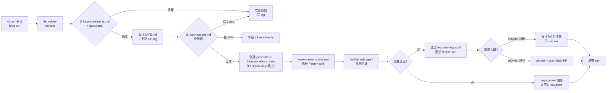
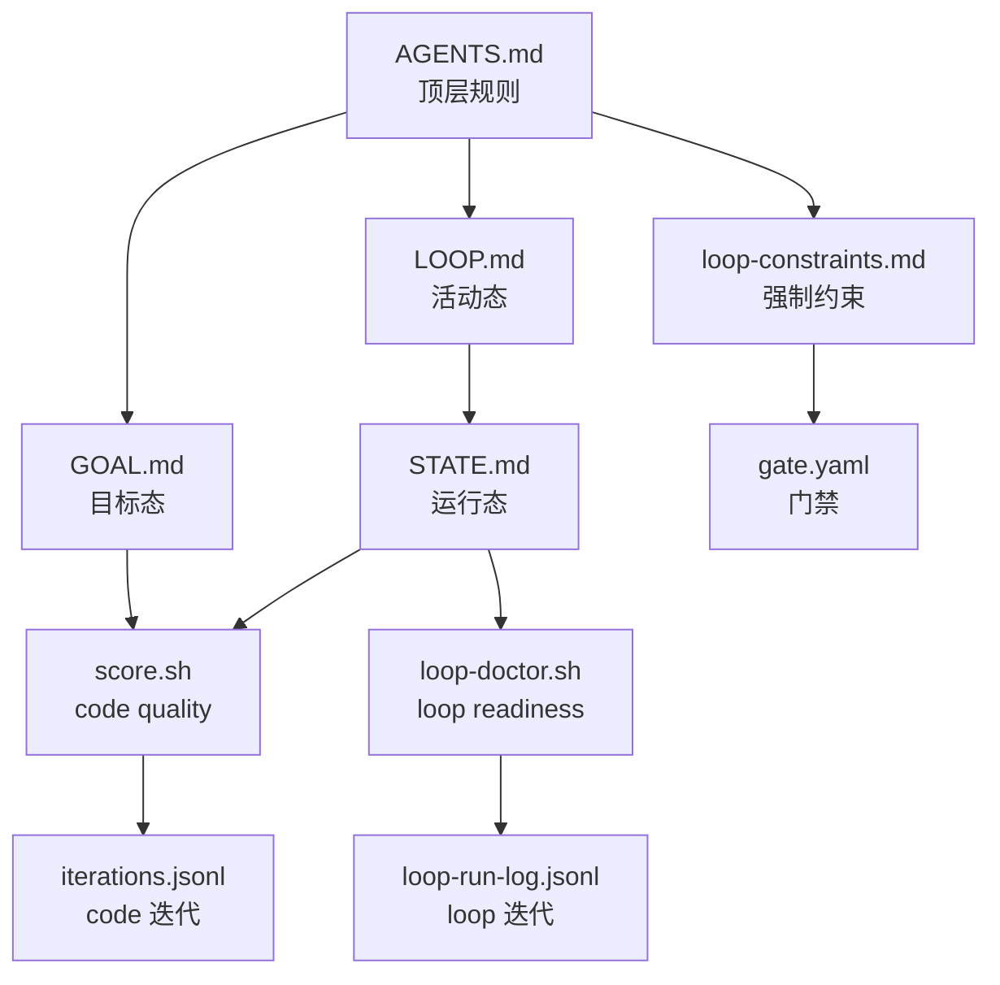

# 完整集成方案

本文档是 Loop-Engineering 引入 AutoHarness 的**主设计文档**，包含调研结论、设计原则、目标架构、五大原语映射、状态机、安全门禁、CLI 工具矩阵。

阅读对象：架构师、Tech Lead、需要理解"为什么这么做"的人。

---

## 1. 调研结论：双方都已经"半成品"了

### 1.1 loop-engineering 给的是什么

**一句话**：把"AI Agent 一次性提示词"提升为"持续编排、状态化、有安全门禁、可度量、可演进"的循环系统。

**五大原语 + Memory**：

1. **Scheduling**（调度心跳）— 没有调度，一次性跑就是 prompt；有调度才是 loop
2. **Worktrees**（隔离工作树）— 并行不冲突的工程机制
3. **Skills**（意图持久化）— SKILL.md 承载"我们不这么干，因为 X 事故"
4. **Connectors/MCP**（连真实工具）— GitHub/Slack/Linear 不是只读，能写
5. **Sub-agents Maker/Checker**（制作者/检查者分离）— 单 agent 永远是自己代码的最差评审

**配套机器可读文件**（这是关键创新）：
- `LOOP.md`（活动 loop 清单 + 心跳表）
- `STATE.md`（实时运行状态，loop 自更新）
- `loop-budget.md`（token 配额 + kill switch）
- `loop-run-log.md`（JSONL 追加式运行日志；AutoHarness 落地为 `loop-run-log.jsonl`，见 §3.1）
- `loop-constraints.md`（**强制**约束，skill 每次启动读取）
- `gate.yaml`（路径黑/白名单 + auto-merge 允许清单）
- `patterns/registry.yaml`（模式注册表）

**成熟度四级**（渐进放量）：L0 Draft → L1 Report → L2 Assisted → L3 Unattended。

### 1.2 AutoHarness 现状盘点

| 概念 | AutoHarness 已有 | 状态 |
|---|---|---|
| Maker/Checker 分离 | `HarnessType::{Verifier, Critic, Refiner, Ensemble, Adaptive}` **就是**这个概念的类型系统编码 | 已有概念，缺调度 |
| 状态化迭代日志 | `iterations.jsonl`（追加式、机器可读） | 等价于 `loop-run-log.md` |
| 目标/适应度 | `GOAL.md` + `scripts/score.sh` | 单目标 fitness，缺 loop readiness |
| 计划沉淀 | `PLANS.md` + `plans/*.md`（施工前计划、完工删除） | 比 loop-engineering 更严 |
| 文档沉淀 | `DOCS.md` + `docs/**`（完工不删） | 已有 |
| Skill 体系 | 11 个 SKILL.md（goal-md×3、codebase-harness×4、loops×1、utilities×3） | 已有 |
| 调度心跳 | **缺** | 需要补 |
| 路径门禁 | **缺** | 需要补 |
| 状态机（STATE.md） | **缺**（GOAL.md 是目标态，不是运行态） | 需要补 |
| Loop readiness 评分 | **缺** | 需要补 |
| 模式目录 | 仅 `improvement-loop` 1 个 | 需要扩展 |
| 约束文件 | AGENTS.md 散布 | 需要合并机械可读版 |
| MCP 连接器 | **缺** | 可选补 |

### 1.3 关键洞察

AutoHarness 已经在工程哲学上**走在了 loop-engineering 前面**（Plan→Doc 分离、单文件 500 行上限、KISS、100% 覆盖目标）。

loop-engineering 的真正价值是补齐**调度心跳、安全门禁、模式目录、状态机分离**这四块。

**杀手锏**：AutoHarness 已经在类型系统里有 `HarnessType::{Refiner, Verifier}`，L2 的 maker/checker 分离**零成本**。

---

## 2. 设计原则

按重要性排序，作为所有决策的硬性约束：

1. **零侵入**：loop-engineering 是**方法论层叠加**，不改 `src/**` 任何 Rust 代码；不替换 GOAL.md / iterations.jsonl / PLANS.md / DOCS.md
2. **复用优先**：用现有的 `score.sh` 作 fitness、复用 `HarnessType` 类型作 maker/checker、复用 `skills/` 目录结构
3. **Rust-native**：不复制 npm CLI，把工具写成 `cargo run -- loop-*` 子命令（一个二进制多个子命令，符合现有 `main.rs` 风格）
4. **L1 优先**：前 2 周只跑 L1 Report-only，绝不自动改代码
5. **人类永远是最终门**：`STATE.md` 里的待办必须可读、可审、可中断
   - **三层写入规则**：① PR 分支内可自动 commit（如 fmt 修复）→ ② allowlist 路径可自动 merge（draft PR 人审后）→ ③ main 永不自动 merge；`loop-bot` 的 L1 报告 push（仅 STATE.md / LOOP.md / loop-run-log.jsonl）是唯一自动 push 例外
6. **机器可读 + 人类可读**：YAML/JSONL 给机器，Markdown 给人类
7. **小步快跑**：用现有 `iterations.jsonl` 同样范式记录 loop 自身的演进

---

## 3. 目标架构

### 3.1 顶层目录布局（增量新增，不动现有结构）

```
AutoHarness/
├── AGENTS.md                  ← 现有，扩展"Loop 操作"章节
├── GOAL.md                    ← 现有，不变（目标态）
├── STATE.md                   ← 新增（运行态）
├── LOOP.md                    ← 新增（活动 loop 清单 + 心跳表）
├── loop-budget.md             ← 新增（配额 + kill switch）
├── loop-run-log.jsonl         ← 新增（追加式运行日志）
├── loop-constraints.md        ← 新增（机械可读的强制约束）
├── gate.yaml                  ← 新增（路径黑/白名单）
├── DOCS.md                    ← 现有，加 loop-engineering 索引
├── PLANS.md                   ← 现有，加本次计划条目
├── docs/
│   └── loop-engineering/      ← 本目录
├── src/
│   └── loop/                  ← 新增子 crate 模块
│       ├── mod.rs
│       ├── state.rs
│       ├── log.rs
│       ├── constraints.rs
│       ├── budget.rs
│       ├── gate.rs
│       ├── audit.rs
│       ├── runner.rs
│       └── worktree.rs
├── skills/loops/              ← 复用现有 loops category（新增 6 个，符合两级目录惯例）
│   ├── loop-triage/SKILL.md
│   ├── loop-budget/SKILL.md
│   ├── loop-guard/SKILL.md
│   ├── loop-verifier/SKILL.md
│   ├── loop-init/SKILL.md
│   └── loop-doctor/SKILL.md
├── patterns/
│   └── registry.yaml          ← 新增，机器可读模式注册表
├── scripts/
│   ├── score.sh               ← 现有（code quality fitness）
│   └── loop-doctor.sh         ← 新增（loop readiness）
└── .github/workflows/
    ├── loop-daily-triage.yml      ← 新增（cron 1d weekday）
    ├── loop-clippy-watch.yml      ← 新增（on PR）
    ├── loop-release-drafter.yml   ← 新增（on tag）
    └── loop-dependency-watch.yml  ← 新增（cron 1w）
```

### 3.2 数据流（一次 loop 调度的生命周期）



### 3.3 与现有体系的关系



### 3.4 机器文件 schema 与模板

**`loop-run-log.jsonl` 每行 schema**（追加式，一次 run 一行）：

```json
{"run_id":"20260806T000500Z-001","ts":"2026-08-06T00:05:00Z","pattern":"improvement-loop","level":"L1","trigger":"cron","status":"ok|noop|failed|escalated","findings":2,"actions":1,"escalations":0,"tokens":42000,"score_before":85,"score_after":85,"git_sha":"abc1234"}
```

字段约定：`score_before/after` 仅 code fitness（score.sh `total`）；`status=escalated` 时须在 STATE.md Human Inbox 有对应条目。

**`loop-budget.md` 模板**：

```markdown
# Loop Budget

| 范围 | 预算 | 检查时机 |
|---|---|---|
| 全局日 token | 150000 | 每次 run 前 |
| 单 Pattern 日 token | 见 registry.yaml `suggested_daily_cap` | 每次 run 前 |
| 80% 阈值 | 降级 L1 report-only | 达 80% 时 |
| 100% 阈值 | 立即退出 + log | 达 100% 时 |
| 月 token | 3000000 | 每月 1 日 |

## Kill Switch
- pause-all: false   # 置 true 后所有 loop 立即停止
- pause-<pattern>: false
```

**`LOOP.md` 模板**（活动 loop 清单 + 心跳表）：

```markdown
# Loop 清单

| Pattern | Level | Cadence | 最近 run | 心跳 OK |
|---|---|---|---|---|
| improvement-loop | L1 | 1d | 2026-08-06T00:05Z | ✅ |

## 心跳表（loop-doctor 用）
- 每 24h 至少 1 条 loop-run-log.jsonl 记录，否则 R1 扣分
```

---

## 4. 五大原语到 AutoHarness 的映射

| 原语 | loop-engineering 含义 | AutoHarness 实现策略 |
|---|---|---|
| **Scheduling** | `/loop 1d`、cron、GitHub Actions | Q2=A：纯 GitHub Actions cron；不引入守护进程 |
| **Worktrees** | 一个 fix 一个 worktree | 封装 `loop-worktree create --run-id --pattern`；可用 std::process 调用 git |
| **Skills** | SKILL.md + 脚本/引用 | **完全复用**现有 `skills/` 体系（`codebase-harness/verify`、`goal-md/score-check` 等可直接被 pattern 调用） |
| **Connectors/MCP** | GitHub/Slack/Linear | **本方案不实现 MCP server**（项目无此需求）；预留 `src/loop/connector/` trait 接口，未来按需加 |
| **Sub-agents** | Maker/Checker | **杀手锏**：`HarnessType::Refiner` 作 implementer（maker）；checker 用双 gate——`Verifier` 验有效性 + `Critic` 评质量；零额外依赖 |
| **Memory** | STATE.md / 数据库 | STATE.md + `memory/store.rs`（已有）；loop 状态走 STATE.md，跨 run 长期数据走现有 `memory::MemoryStore` |

### 4.1 Maker/Checker 的"零成本复用"

loop-engineering 在 JS 工具里要 spawn 子 agent、换 model context。AutoHarness 已经在类型系统里：

```rust
pub enum HarnessType {
    // maker：产出改进补丁（implementer）
    Refiner,
    // checker 双 gate
    Verifier,  // gate 1：action 有效性检查（valid/invalid）
    Critic,    // gate 2：action 质量评分
    Filter, Policy, Ensemble, Adaptive,  // 其他角色，loop 暂不直接使用
}
```

> 依据 `src/core/harness.rs` 语义：`Verifier` 只判有效性、`Critic` 才评质量。L2 的"自动小修"路径上，`Refiner → Verifier + Critic`（`Refiner` 出补丁；`Verifier` 验证补丁合法性、`Critic` 评审是否达标）是**零额外依赖**的天然 maker/checker 分离。

---

## 5. 状态机：STATE.md vs GOAL.md

| 字段 | GOAL.md | STATE.md |
|---|---|---|
| 角色 | 目标态（Target） | 运行态（Operational） |
| 谁写 | 人类 | Loop 自动 |
| 更新频率 | 周/月 | 每次 run |
| 包含 | Fitness 函数、Action 目录、约束 | 当前待办、最近噪音、最近 run、escalation 列表 |

**STATE.md 模板**：

```markdown
# Loop State — AutoHarness

Last run: 2026-08-06T00:05Z (improvement-loop, L1)

## High Priority (loop is acting or waiting on human)
- [ ] Iteration #4 — score 卡在 78
  Loop action: 待 /improvement-loop skill 提议；等人类选 Action

## Watch List
- clippy 有 3 条警告，需补 allow 属性

## Recent Noise (ignored this run)
- Cargo.lock 自动更新（Dependabot）

## Kill Switch
- pause-all: false

## Recent Runs
- 2026-08-06 improvement-loop L1 — 5min, 2 found, 1 action, 0 escalate
- 2026-08-05 improvement-loop L1 — 6min, 1 found, 0 action, 0 escalate

## Accuracy Tracking（Phase 2 起启用，loop-accuracy.sh 解析）
- 2026-08-06 review: 5 items, 4 hit, 1 miss → 80%
- L2-unlock-approved: <date> <signer>   # Q3=A 门 4，人类签字后出现

---
Read by: .github/workflows/loop-daily-triage.yml
```

**绝对不混淆**：GOAL.md 不会被 loop 改、loop 不会自己改 score.sh。

---

## 6. 安全门禁

### 6.1 `gate.yaml`（机器可读，对应工具 `loop-gate`）

```yaml
version: 1
denylist:
  - ".env"
  - ".env.*"
  - "**/secrets/**"
  - "**/*_key*"
  - "**/*_secret*"
  - "**/Cargo.lock"             # 强制 deny；dependency-watch 只开 PR、不自动改 lockfile（见 patterns §1.7）
  - "src/core/harness.rs"       # 核心 trait 改动需 review
  - "src/engine/synthesis.rs"   # 核心引擎改动需 review
  - "src/engine/thompson.rs"    # 采样逻辑改动需 review
  - "src/main.rs"               # CLI 入口改动需 review
maxFiles: 10
autoMergeAllowlist:
  - "docs/**"
  - "**/*.md"
  - "tests/**"
  - "skills/**/SKILL.md"
  - "scripts/**"
```

### 6.2 `loop-constraints.md`（人类读 + skill 解析）

```markdown
## Push & Merge
- 不要 push 前不说（loop-bot 的 L1 报告 push 是唯一自动例外）
- main 上绝不自动 merge；永远先开 draft PR
- 三层写入规则：PR 分支内可自动 commit → allowlist 路径可自动 merge → main 永不自动 merge

## Paths
- 永不改 .env / Cargo.lock / src/core/* / src/engine/* / src/main.rs
- 改 docs/** 可自动
- 改 skills/** SKILL.md 可自动
- 改 tests/** 可自动

## Code
- 改前必跑 cargo fmt
- 改前必跑 cargo clippy
- 改前必跑 cargo test
- 每项 fix 最多 3 次尝试，超过 escalate
- 单次 run 只修一处

## Budget
- token 用到 80% 切 L1
- token 用到 100% 退出
- kill switch (pause-all) 激活立即退出

## Score
- 不许降低 score.sh 分数
- 不许回退已达成的 milestone
```

---

## 7. CLI 工具矩阵（Rust-native 子命令）

不复制 npm 包，全部进 `cargo run -- loop-*`：

| 子命令 | 作用 | 等价 npm |
|---|---|---|
| `loop init` | 脚手架 + 算 Ready Score | `loop-init` |
| `loop doctor` | 10 维评估 + Top-3 行动 | `loop audit + sync` |
| `loop status` | 打印 STATE.md 摘要 | - |
| `loop cost --pattern X` | token 估算 | `loop-cost` |
| `loop context --check` | 熔断检查（3 次超限就停） | `loop-context` |
| `loop gate check` | 验证路径在 denylist/allowlist | `loop-gate` |
| `loop worktree create --run-id` | 创建隔离 worktree | `loop-worktree` |
| `loop run --pattern X --level L1` | 跑一次 | - |
| `loop sync` | STATE.md ↔ LOOP.md 漂移检测 | `loop-sync` |

**统一入口**：

```bash
cargo run -- loop init .
cargo run -- loop doctor .
cargo run -- loop run --pattern improvement-loop --level L1
```

**子命令 → 模块映射**（防止 9 个子命令与 `src/loop/` 模块漂移）：

| 子命令 | 模块 |
|---|---|
| `loop init` / `loop status` | `state.rs` + `constraints.rs` |
| `loop doctor` | `audit.rs` |
| `loop run` | `runner.rs` |
| `loop cost` | `budget.rs` |
| `loop context --check` | `runner.rs` |
| `loop gate check` | `gate.rs` |
| `loop worktree create` | `worktree.rs` |
| `loop sync` | `state.rs` |

---

## 8. 与现有体系的边界（重要）

| 文件 | 谁管 | loop 可读 | loop 可写 |
|---|---|---|---|
| `GOAL.md` | 人类 | ✅ | ❌ |
| `PLANS.md` | 人类 | ✅ | ❌ |
| `DOCS.md` | 人类 | ✅ | ❌ |
| `iterations.jsonl` | 人类 + score.sh | ✅ | ✅（code fitness） |
| `AGENTS.md` | 人类 | ✅ | ❌（除非追加 Loop 操作章节） |
| `STATE.md` | loop + 人类 | ✅ | ✅ |
| `LOOP.md` | loop | ✅ | ✅ |
| `loop-budget.md` | 人类 | ✅ | ❌ |
| `loop-run-log.jsonl` | loop | ✅ | ✅ |
| `loop-constraints.md` | 人类 | ✅ | ❌ |
| `gate.yaml` | 人类 | ✅ | ❌ |
| `patterns/registry.yaml` | 人类 | ✅ | ❌ |
| `score.sh` | 人类 | ✅（只读调用） | ❌ |

---

## 9. Q1=B 带来的额外要求

AutoHarness 作为对外示例：

1. **`examples/minimal-rust-loop/`** 目录（极简版，fork 起点）
2. **`docs/loop-engineering/autoharness-example.md`**（"我是怎么把 Rust 项目跑成 loop 的"）
3. **README 开头加 loop-engineering 徽章 + 简介**
4. **`patterns/registry.yaml` 加 `project: autoharness` 字段**
5. **每个 Pattern 的 `docs/loop-engineering/patterns/` 文档必须标注"AutoHarness 是怎么用这个 Pattern 的"**

---

## 10. Q2=A 带来的 Workflow 列表

| Workflow | 频率 | 触发条件 | 估算 minutes/月 |
|---|---|---|---|
| `loop-daily-triage.yml` | `0 8 * * 1-5` | cron weekday | ~30 |
| `loop-clippy-watch.yml` | on PR | pull_request | ~50 |
| `loop-release-drafter.yml` | on tag | tag push | ~5 |
| `loop-dependency-watch.yml` | `0 0 * * 0` | cron weekly | ~10 |
| **总计** | | | **~95/month**（免费额度 2000 内） |

每个 workflow 标准步骤：

```yaml
permissions:
  contents: write       # 仅写 STATE.md / LOOP.md / loop-run-log.jsonl
  pull-requests: write  # 开 draft PR / 评论
  issues: write         # escalation 开 issue
steps:
  - uses: actions/checkout@v4
  - name: Build
    run: cargo build --release
  - name: Run loop
    run: cargo run --release -- loop run --pattern ${{ env.PATTERN }} --level L1
  - name: Commit STATE if changed
    run: |
      if [[ -n "$(git status --porcelain STATE.md)" ]]; then
        git config user.name "loop-bot"
        git config user.email "loop-bot@users.noreply.github.com"
        git add STATE.md loop-run-log.jsonl
        git commit -m "loop(${{ env.PATTERN }}): L1 report"
        git push
      fi
  - name: Upload artifact
    uses: actions/upload-artifact@v4
    with:
      name: loop-run-log
      path: loop-run-log.jsonl
```

---

**详细 Pattern 列表** → [patterns-and-levels.md](patterns-and-levels.md)
**Phase 1-4 实施路线** → [implementation-roadmap.md](implementation-roadmap.md)
**风险与边界** → [implementation-roadmap.md §3](implementation-roadmap.md#3-风险与边界)

**最后更新**：2026-08-06